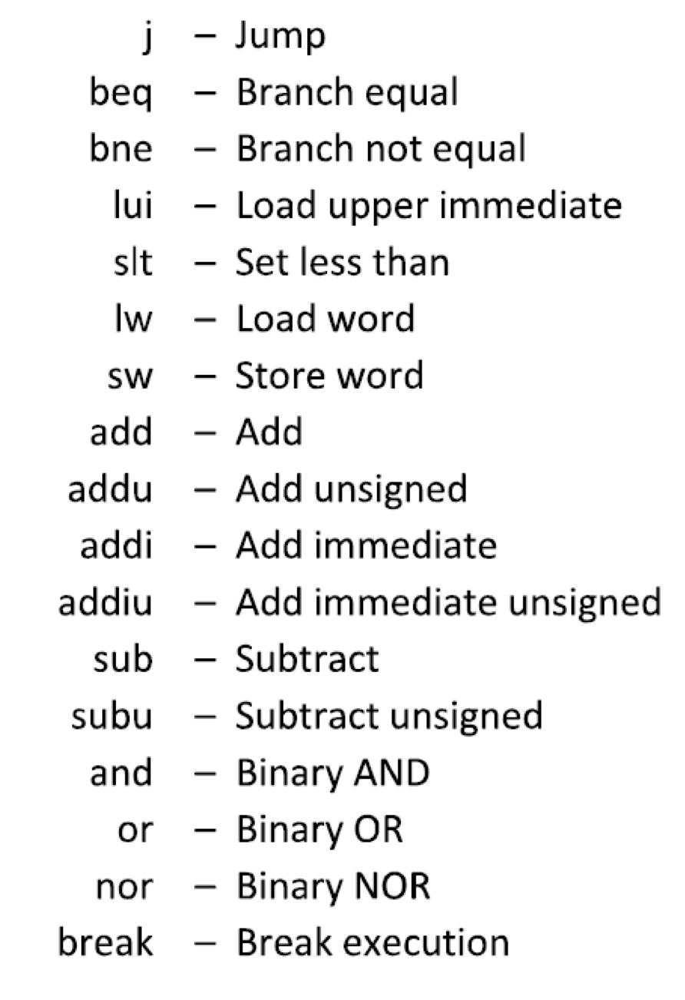
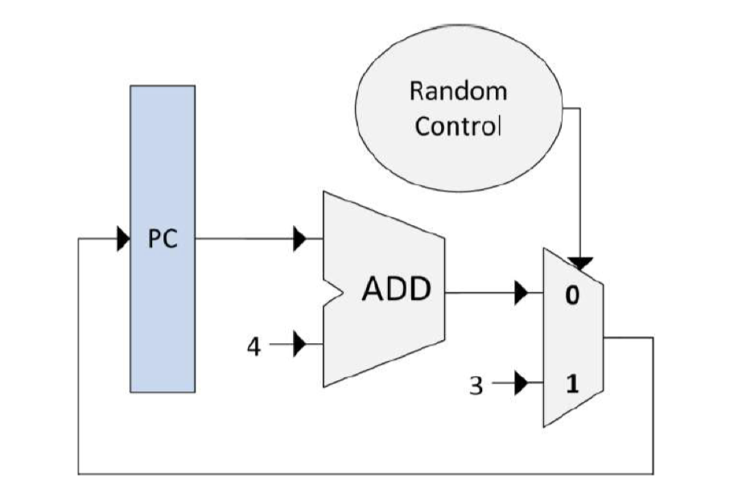

# INF-2200 Computer Architecture and Organization

## Mandatory Assignment 2: MIPS Simulator

### Introduction and Design

In this assignment, you will implement a binary code simulator for a subset of the MIPS architecture. You will simulate the pipelined datapath and controller described in your textbook. We will provide you with the pre-code you should use as a starting point. Your simulator should support the following instructions:

| |
|:--:|
| **Figure 1: MIPS instructions** |

We also provide you with a couple of sample programs that you can use during development. 

## Pre-code

The pre-code consists of Python-files that define the main simulator class’s API and implement the simple single-cycle control and datapath shown in Figure 1.

| |
|:--:|
| **Figure 2: Simple single-cycle control and datapath implemented in pre-code** |

All control and datapath elements are subclasses of the CPUElement class. This class maintains four main data structures: 

-   A table of input data implemented as a dictionary (map) with one entry per input data. A unique name for each input is used as key and the input data as the value.
-   A table for the output data implemented as a dictionary that maps unique output names to output values with one entry per output
-   A table of input control signals implemented as a dictionary that maps unique signal names to signal values with one entry per input signal
-   A table of output control signals implemented as a dictionary that maps unique signal names to signal values with one entry per output signal

CPUelement defines the following eight methods:

-   **\_\_init\_\_**: Constructor. The default constructor does not do anything, but a subclass may not need to initialize data structures, etc.
-   **connect**: Called once per CPU Element instance during initialization to connect the data paths and control paths to other elements. **All subclasses of CPUElement must implement this method**.
-   **readinput**: Read input data from source elements, and update an internal table with the input data.
-   **readControlSignals**: Read and set control signals
-   **writeOutput**: Using the input data and control signals, do the necessary computation, and update an internal table with the output data. **All subclasses of CPUElement must implement this method**.
-   **setControlSignals**: Using the input data and control signals, do the necessary computation, and set the output control signals. **All subclasses of CPUElement must implement this method**.
-   **getOutputValue**: Called during ***readInput()*** to read the output data calculated in the previous iteration.
-   **getControlSignal**: Called during ***readControlSignals()*** to get a control signal set in the previous iteration.

You must implement a subclass for each type of element in your control or data path. You must also implement the ***initializeMemory()*** method in the Memory class so that the InstructionMemory and DataMemory instances can be initialized by reading binary data from a file. 

The simulator does the following:

1.  Create an object for each control and datapath element.
2.  Connect the elements by specifying input and output data and signals.
3.  For each cycle:

    1.  For each element, call ***readControlSignals()*** and ***readInput()***
    2.  For each element, call ***writeOutput()*** and ***setControlSignals()***
    3.  Check if the break instruction has been encountered and exit the loop if so.

4.  Print the content of the registers and the number of cycles that were executed.

The check for the break instruction is not implemented in the pre-code, and you must therefore add a mechanism to do this test. Also, note that the order the different elements are read from and written to is of significance and that reading to and writing from pipeline registers must be considered specially for the pipelining to work as intended. 

Included in the pre-code are a few simple programs with filetype “.mem”, implemented in binary code, which can be used to initialize the instruction and data memory elements. The file is a tab-delimited text file, where the first and second columns contain memory addresses and memory content, respectively, both represented as 32-bit hexadecimal numbers, and the third column contains comments. Note that although the comments are assembly code, your simulator should run using the binary code only. Also note that the memory addresses do not start from zero, but from the address **0xbfc00000**, and that the program does not use any memory besides of that defined in the file. 

Although both the instruction memory element and data memory element will initially read the same memory file’s contents, they are treated as separate, isolated entities. The instruction memory will be read-only, and although the data memory also contains the instructions, modifying these will not work and should be avoided.

**Data hazards**

Your simulated datapath and controller should handle data hazards. You can choose to implement forwarding, stalling, or another approach. Your report should describe your chosen approach and discuss it’s cost, complexity, and performance compared to at least one alternative approach.

**Control hazards**

Your simulated datapath and controller should handle controller hazards. You need to find an approach, implement it, and describe it in the report.

**Testing**

An important part of the assignment is to design test cases that demonstrate that your pipeline works correctly when the executed code causes data or control hazards. To do this, you need to write code with known data dependencies, which will cause data and control hazards. You should write this code in MIPS assembly using the instruction subset listed above, convert that code to binary by hand and run the code on your simulator.

**Deliverables**

You are allowed to either work alone or in groups of two. Each group is required to submit a single code and report, but we recommend that both group members do all parts of the project independently. The report should contain all necessary information for an expert to evaluate your design and implementation. You should assume that the expert has neither read the textbook nor the assignment text. 

The report should contain the following:

1.  Summary of the datapath and controllers you are simulating
2.  Description of data hazard handling approach including a discussion about the cost, complexity, and performance of the approach
3.  Controller hazard handling approach
4.  Description of the simulator implementation, including the functions you have implemented
5.  A detailed description of the test cases you have designed
6.  Summary of known bugs and problems

**Submission**

Submit the report and python code to GitHub. A group can have a maximum of two people. A group only need one repository, where the repository must contain the following:

The report must be in PDF format, placed in a folder called «doc» together with a file «readme.txt» that includes instructions for executing your code and testing it for correctness. All source code must be placed in a folder called «src». A file in the root, where the file name has the format «abc001-Gx», i.e., all usernames of the group are separated by a hyphen (-), and the X is replaced with the group number. E.g., abc001-G2. The last commit before the deadline will be evaluated! 

**Grading**

The assignment will be given a passed / not passed grade. The grade is based on the code and the written report. 

**Useful resources**

-   Textbook
-   Powerpoint slides on Canvas (especially those by Mary Jane Irwin).
-   TA’s
-   The web has good resources on MIPS instructions
